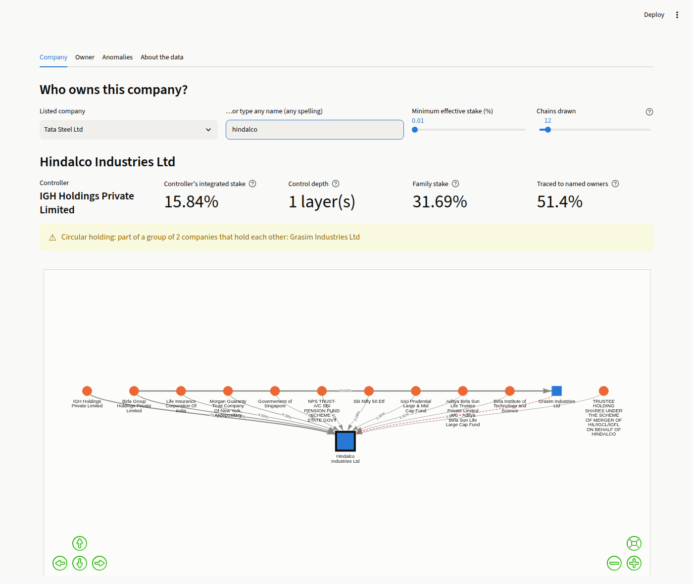

# Beneficial Ownership Discovery in Corporate Networks

Course project (Data Structures and Algorithms) — Pashmee Salunkhe, Roll No. 17.
Follows `CP_Implementation_Plan.docx`.

**Project report: [`docs/report.md`](docs/report.md)** — results, evaluation against the plan's five criteria, complexity analysis with measured data.

## Status

| Phase | Status |
|---|---|
| 1. Data acquisition and schema design | **Done** |
| 2. Ingestion and parsing module | **Done** |
| 3. Entity resolution | **Done** |
| 4. Graph construction and chain traversal | **Done** — first end-to-end build |
| 5. Cycle and structure detection | **Done** |
| 6. Cross-holding and control metrics | **Done** |
| 7. Interface and visualisation | **Done** — `streamlit run app.py` |
| 8. Evaluation and documentation | **Done** — [project report](docs/report.md) |

### Phase 1 deliverable

- Dataset: [`data/ownership_relations.csv`](data/ownership_relations.csv) — 946 ownership relations across 46 listed companies (Tata, Aditya Birla and Murugappa groups), from BSE shareholding-pattern filings.
- Schema, scope, cleaning rules and known limitations: [`docs/schema.md`](docs/schema.md).
- Build statistics: [`data/build_report.json`](data/build_report.json).

### Phase 2 deliverable

- Ingestion module: [`ownership/ingest.py`](ownership/ingest.py) (reader, parser, validation) and [`ownership/normalise.py`](ownership/normalise.py) (name normaliser).
- Unit tests: [`tests/`](tests), 49 tests for Phase 2, most of them over malformed input.
- Design, validation rules and results: [`docs/ingestion.md`](docs/ingestion.md). The Phase 1 dataset loads in full (946 records, 0 rejected); normalising reduces 664 distinct names to 513.

```
python -m unittest             # run the test suite
python -m ownership.ingest     # ingest the dataset, write data/ingest_report.json
```

### Phase 3 deliverable

- Entity index: [`data/entity_index.csv`](data/entity_index.csv) maps all 664 name variants to 405 canonical entity IDs.
- Resolver: [`ownership/resolve.py`](ownership/resolve.py) (capacity parser, match key, union-find), [`ownership/trie.py`](ownership/trie.py) (trie with prefix and near-match lookup), [`ownership/similarity.py`](ownership/similarity.py) (Levenshtein).
- Accuracy: **precision 1.00, recall 0.92** on 100 hand-labelled name pairs ([`data/er_validation_pairs.csv`](data/er_validation_pairs.csv)), with an ablation and a blocking benchmark in [`data/er_evaluation.json`](data/er_evaluation.json).
- Method, evaluation and limitations: [`docs/entity_resolution.md`](docs/entity_resolution.md).

```
python -m ownership.resolve    # build the entity index
python -m ownership.er_eval    # precision / recall, ablation, blocking benchmark
```

### Phase 4 deliverable

- Query interface: `python -m ownership.query "<company name>"` prints the company's ownership chains ranked by effective stake, its ultimate owners, and any circular holdings on its chains.
- Graph: [`ownership/graph.py`](ownership/graph.py) (adjacency lists). Traversal: [`ownership/chains.py`](ownership/chains.py) (DFS with an explicit stack).
- All chains of all 46 listed companies: [`data/ownership_chains.csv`](data/ownership_chains.csv) (1,570 at the default 0.01% threshold; 313,822 with none), summary in [`data/chains_report.json`](data/chains_report.json).
- Method and findings: [`docs/chains.md`](docs/chains.md).

```
python -m ownership.query "tata steel"
python -m ownership.query --report     # regenerate the chain files
```

### Phase 5 deliverable

- Anomaly report: [`data/anomaly_report.json`](data/anomaly_report.json) — 4 circular-holding groups covering 18 companies (including an 11-company Tata cluster), 9 indirectly controlled companies, and 4 corporate families recovered from promoter holdings.
- Algorithms: [`ownership/structure.py`](ownership/structure.py) — DFS back edges, Tarjan's SCC, BFS control depth, component labelling; all cross-checked against NetworkX in the tests.
- Findings: [`docs/structure.md`](docs/structure.md).

```
python -m ownership.structure          # print and write the anomaly report
pip install -r requirements-dev.txt    # NetworkX, for the verification tests only
```

### Phase 6 deliverable

- Control-concentration metrics per company and per family: [`data/control_metrics.json`](data/control_metrics.json). Family stake (mean): Tata 42.5%, Aditya Birla 35.5%, Murugappa 34.4%.
- Exact integrated stakes through cross-holdings, from stake matrices of the circular groups summed by repeated multiplication: [`ownership/control.py`](ownership/control.py), [`ownership/matrix.py`](ownership/matrix.py); every owner–company pair in [`data/integrated_ownership.csv`](data/integrated_ownership.csv). Loops add at most 0.055 percentage points to any company.
- Chains stored as trees rooted at beneficial owners: [`ownership/forest.py`](ownership/forest.py).
- Method and findings: [`docs/control.md`](docs/control.md).

```
python -m ownership.control     # family table + data files
```

### Phase 7 deliverable

- The app: `pip install -r requirements.txt` then `streamlit run app.py`. It has three views:
  - **Company:** any name in any spelling → ranked chains, ultimate owners, and an interactive ownership graph with circular holdings highlighted.
  - **Owner:** everything an owner such as Tata Sons reaches.
  - **Anomalies:** the dashboard of circular holdings, deep chains and family control.
- Works offline (vis-network inlined). Screenshots and design notes: [`docs/app.md`](docs/app.md).



### Phase 8 deliverable

- Project report with the complexity analysis and measured data: [`docs/report.md`](docs/report.md).
- Correctness: every algorithm agrees with NetworkX / NumPy on the real graph and synthetic graphs up to 5,000 nodes, including all 313,822 real ownership chains: [`data/verification.json`](data/verification.json) (`python -m ownership.verify`).
- Scalability: all O(V + E) algorithms measure a log-log slope of 1.04–1.12 from 100 to 10,000 nodes; adjacency list vs matrix at 5,000 nodes: 113× less memory, ~3,100× faster BFS. [`data/benchmark.json`](data/benchmark.json) (`python -m ownership.benchmark`).

## Reproducing

```
python scripts/p1_fetch.py quarter
python scripts/p1_fetch.py scan       # about 30-60 min, resumable
python scripts/p1_fetch.py fallback
python scripts/p1_fetch.py public
python scripts/p1_build_dataset.py    # writes data/ownership_relations.csv
```

Raw responses (`data/raw/promoter`, `pro129`, `public`, `pub129`) are git-ignored; the commands above regenerate them. Phases 1–6 use only the Python 3.11 standard library. The Phase 7 app needs Streamlit and PyVis (`requirements.txt`); NetworkX and NumPy are used only by the tests (`requirements-dev.txt`).
