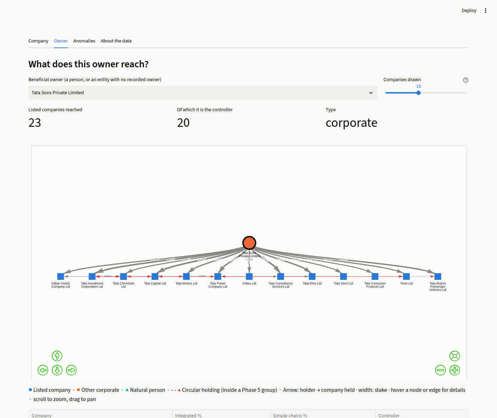
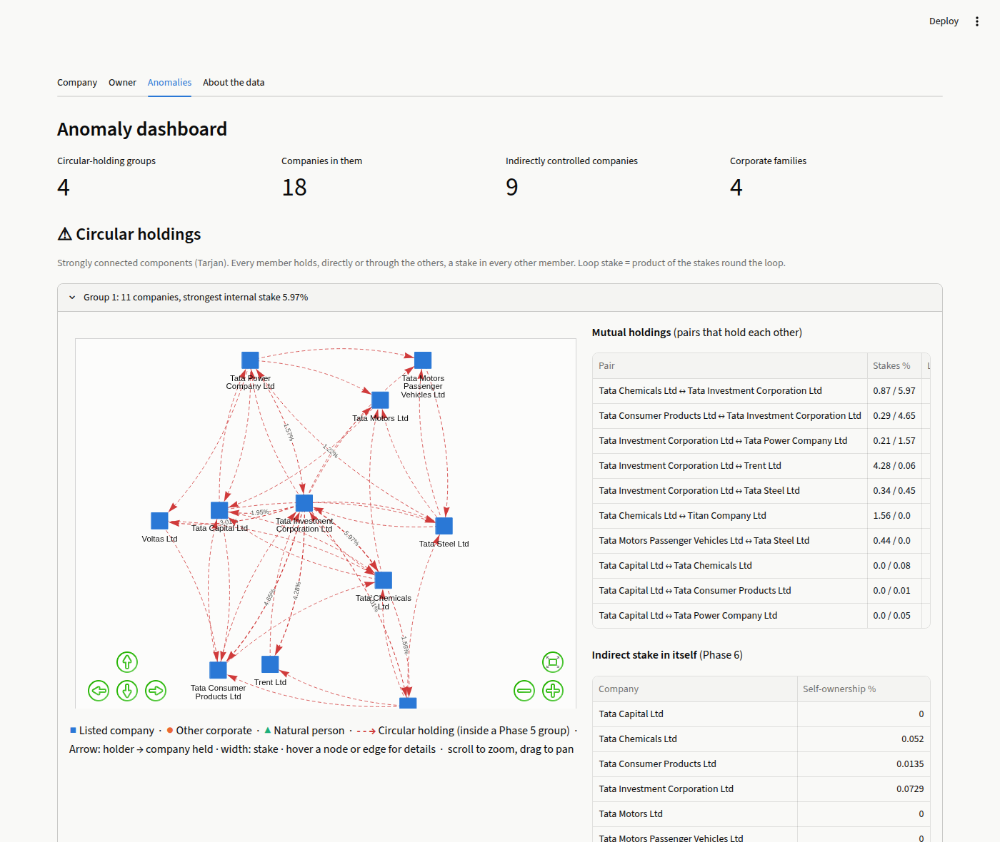

# Phase 7 — Interface and Visualisation

Deliverable for Phase 7 of `CP_Implementation_Plan.docx`: a demonstrable application for the viva. It has a query interface that renders a company's resolved chain, a visual ownership sub-graph with circular holdings highlighted, and an anomaly dashboard.

```
pip install -r requirements.txt       # streamlit, pyvis (the first runtime dependencies; Phases 1–6 are standard library)
streamlit run app.py                  # opens http://localhost:8501
```

| File | Contents |
|---|---|
| [`app.py`](../app.py) | Streamlit app: Company, Owner, Anomalies and About tabs |
| [`ownership/visual.py`](../ownership/visual.py) | Builds the sub-graphs to draw, and renders them with PyVis (vis-network) |
| [`.streamlit/config.toml`](../.streamlit/config.toml) | Light theme matching the graph colours |
| [`tests/test_visual.py`](../tests/test_visual.py) | 11 tests, including a headless run of the whole app |

The app loads the whole pipeline once at start-up (Phases 2–6, about 1 s) and caches it. Every query after that is interactive. The graph pages embed vis-network inline, so the app works **without internet access** at the viva.

## 1. Company: "who owns this company?"


- **Search.** Pick a listed company, or type any name in any spelling: "hindalko", "TATA STEL", "m m muthiah". The name is matched with the Phase 3 index: exact, then prefix, then near match of the whole name, then near match of its start (see 4).
- **Headline figures:**
  - the controller;
  - the controller's integrated stake, including routes round loops (Phase 6);
  - control depth (BFS, Phase 5);
  - the promoter family's stake;
  - how much of the company the data traces to named owners.
  A warning appears if the company belongs to a circular-holding group.
- **Graph.** The company's ownership sub-graph: every entity and edge on its top chains (default 12; the slider goes up to 100). Owners are drawn above what they hold, one row per ownership layer.
- **Tables.** All chains ranked by effective stake (Phase 4), and ultimate owners with integrated vs simple-chain stakes (Phases 4 and 6).
- **Minimum effective stake** can be raised from the default 0.01% to thin out the graph.
- **Names with no recorded owners.** Tata Sons and other unlisted holding companies file no shareholding pattern. The page says so and shows the entity's holdings and owner tree instead.

## 2. Owner: "what does this owner reach?"



- **Pick an owner.** The list covers every beneficial owner (a person, or an entity with no recorded owner), ordered by how many companies it reaches. Tata Sons is the default.
- **Figures and graph.** How many listed companies the owner reaches, and how many of them it controls. The graph shows the routes to its largest holdings, and a table lists all of them with integrated and simple-chain stakes.
- **No graph traversal.** The answer comes straight from the Phase 6 owner tree: walk one tree for the portfolio, and parent pointers for the routes.

## 3. Anomaly dashboard



- **Headline counts:** 4 circular-holding groups, 18 companies in them, 9 indirectly controlled companies, 4 families.
- **Circular holdings.** One panel per group (Tarjan SCC), with:
  - the group's graph;
  - its mutual holdings, i.e. pairs that hold each other, with the loop stake;
  - each member's indirect stake in itself (Phase 6).
- **Deep chains.** The indirectly controlled companies: controller, control depth, and the route carrying the most stake (Phase 5).
- **Family control concentration.**
  - The family table (Phase 6): mean and median family stake, and the number of companies above 50%, between 25% and 50%, and below 25%.
  - One bar chart per family of each company's family stake, with reference lines at 25% (can block special resolutions) and 50% (majority). Hover a bar for the controller.

## 4. Design choices

**Visual encoding** (`ownership/visual.py`):

| Element | Encoding |
|---|---|
| Entity type | colour **and** shape: listed company = blue square, other corporate = orange dot, natural person = aqua triangle |
| Name | always shown as the node label; full details on hover |
| Stake | edge width; labelled on edges of 1% or more; exact value on hover |
| Circular holding | red **and** dashed edge, named in the hover text and the legend |
| Queried company or owner | larger node with a dark ring |
| Layout | ownership layers: each node's row is its BFS distance from the focus |

- **Colours** are the first three categorical slots of the reference palette. They pass the palette validator for every pair, including under colour-vision deficiency (worst ΔE 9.2 for deuteranopia, target 8).
- **Red** is the palette's reserved "critical" status colour, never used for a category.
- **Colour is never the only channel:**
  - The aqua sits below 3:1 contrast on the light background, so every node carries a visible label and every graph has a table view.
  - Shape repeats type, and the dash pattern repeats "circular".
- **The family charts use a single blue.** Family identity is carried by the chart titles, not by hue.

**Explicit layers.** vis-network's automatic hierarchical layout collapsed into a single line on graphs with cycles, such as Hindalco ↔ Grasim. The app therefore computes each node's row itself, by BFS from the focus, and passes it in. Loops then draw as edges within or between rows, without breaking the layout.

**Fuzzy prefix search** (`Trie.prefix_within`, added in this phase). The Phase 3 lookup matched a misspelling only against whole names, so "hindalko" (8 characters) could not find "hindalco industries" (19). The new trie method finds every key with a *prefix* within edit distance k of the query. It uses the same one-row-per-node dynamic-programming walk as the near-match search: a node whose last cell is ≤ k is a matching prefix, and every key below it matches. A test checks it against brute force.

**Offline rendering.** PyVis inlines vis-network, but its template also links Bootstrap from a CDN for menus the app doesn't use. `render()` removes those tags, and a test checks that the page loads nothing external.

## 5. Verification

- **Headless app run:** `streamlit.testing.v1.AppTest` executes `app.py`, types "hindalko", "tata sons" and a nonsense name, and checks that every view renders without an exception. It is skipped if Streamlit is not installed.
- **Sub-graph builders:** tests check the company, owner and circular-group views, the levels (owners above, owner on top), and the circular flags.
- **Fuzzy prefix search:** compared with brute force on random words.
- **Rendering:** the rendered page is self-contained and every node is present.
- **Manual check:** every view was also checked in Chromium for layout, label overlap and exceptions (screenshots above).

## 6. Known limitations

- **Crowded graphs:** a company or owner with many holders gives a wide graph. The slider limits what is drawn, and scrolling zooms; the tables always hold everything.
- **Streamlit reruns the script on every interaction,** with the pipeline cached, so each query costs a few milliseconds of Python plus rendering.
- **The app reads the committed data** (`data/ownership_relations.csv`). Refreshing it means re-running Phase 1.
