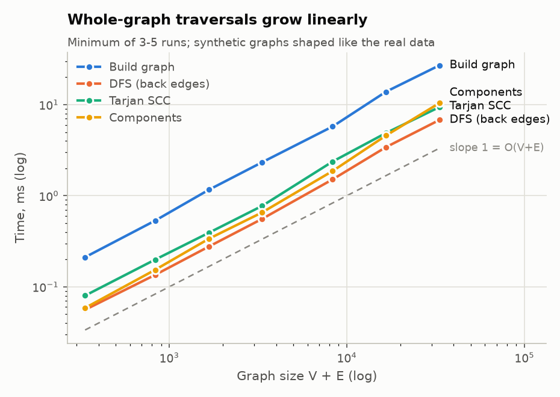
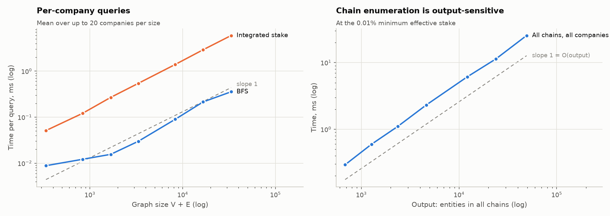
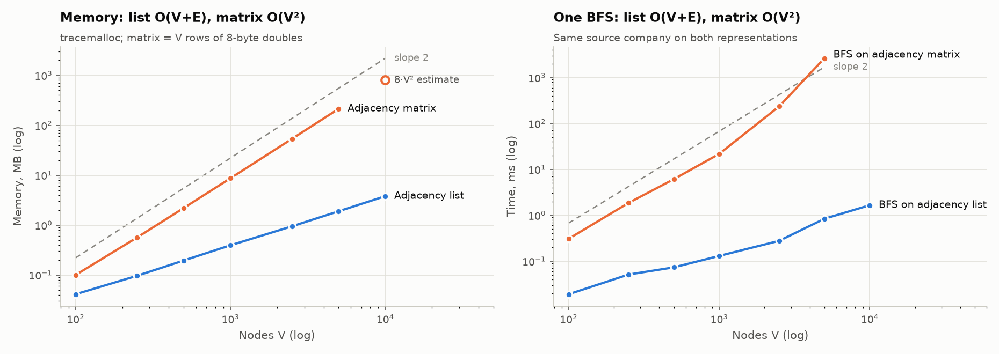

# Beneficial Ownership Discovery in Corporate Networks
### Using Graph Traversal and Cycle Detection — Project Report

Course project, Data Structures and Algorithms · Pashmee Salunkhe, Roll No. 17

---

## Abstract

Indian shareholding filings are public, but the person or entity that ultimately controls a company is often several corporate layers away from it. This project reconstructs ownership chains from BSE shareholding-pattern filings of 46 listed companies in the Tata, Aditya Birla and Murugappa groups (946 ownership relations). From them it identifies each company's controlling owner, detects circular shareholding, and measures how concentrated control is.

The pipeline has seven stages:
1. ingestion and name normalisation;
2. entity resolution with a trie and Levenshtein distance (precision 1.00, recall 0.92 on 100 hand-labelled pairs);
3. an adjacency-list ownership graph;
4. chain traversal by DFS with an explicit stack;
5. cycle detection with DFS back edges and Tarjan's SCC algorithm, control depth by BFS, and family detection by component labelling;
6. exact effective ownership through loops, by repeated matrix multiplication;
7. an interactive application.

Every algorithm is hand-written. Each one agrees with NetworkX or NumPy on the real graph and on synthetic graphs of up to 5,000 nodes. Every O(V + E) algorithm scales with a log-log slope of 1.04–1.12, i.e. linearly, as theory predicts. On a 5,000-node graph the adjacency list needs 113× less memory than an adjacency matrix and runs BFS about 3,100× faster.

The data contains four circular-holding groups; the largest is an 11-company Tata cluster. The loops are weak, though: they change no controller and add at most 0.055 percentage points to any company's traced ownership. Control of almost every company sits in an unlisted holding company (Tata Sons, Ambadi Investments, Birla Group Holdings) whose own owners the filings do not reveal.

---

## 1. Problem and objectives

A shareholder register lists companies as often as it lists people. Following those companies through their own registers, layer after layer, is what reveals the controller. This project builds that traversal and the analysis around it. The objectives, from the implementation plan:

| Objective | Where it is met |
|---|---|
| Model shareholding as a directed weighted graph | Phase 4, `ownership/graph.py` |
| Resolve the chain from a company to its ultimate owner | Phase 4, `ownership/chains.py`; app Company view |
| Detect circular shareholding with cycle detection and SCCs | Phase 5, `ownership/structure.py` |
| Quantify opacity as layers between company and controller | Phase 5 (BFS control depth) |
| Reconcile inconsistent entity naming | Phases 2–3, `ownership/normalise.py`, `ownership/resolve.py` |
| Evaluate correctness and measure runtime scaling | Phase 8, `ownership/verify.py`, `ownership/benchmark.py` |

## 2. Data

Source: BSE shareholding-pattern filings (SEBI format), June 2026 quarter; one company uses March 2026. Scope was chosen from the data, not by hand. All 5,037 active BSE scrips were scanned, and a company is in scope if its promoter register names one of three group anchors:

| Group | Anchor | Companies | Relations |
|---|---|---|---|
| Tata | Tata Sons | 25 | 279 |
| Aditya Birla | Birla Group Holdings | 11 | 236 |
| Murugappa | Ambadi Investments | 10 | 431 |
| **Total** | | **46** | **946** |

Each relation records holder, company held, stake, filing date and holder type, plus provenance fields. Full schema and cleaning rules: [`schema.md`](schema.md).

## 3. Architecture

```
filings ─► Ingestion ─► Entity resolution ─► Graph ─► Analysis ─────────────────► Reporting
           (Phase 2)     (Phase 3)           (Ph. 4)   chains (4), cycles/SCC,      app (7),
           parse,        trie, Levenshtein,  adjacency depth, families (5),        reports,
           validate,     capacity rules,     lists     integrated stakes (6)       benchmarks (8)
           normalise     union-find
```

| Module | Phase | Contents |
|---|---|---|
| `ingest.py`, `normalise.py` | 2 | CSV parser into an array of records; validation; name normaliser |
| `trie.py`, `similarity.py`, `resolve.py` | 3 | trie (exact, prefix, near-match, fuzzy-prefix lookup); Levenshtein; capacity parser; union-find; entity index |
| `graph.py`, `chains.py`, `query.py` | 4 | adjacency-list graph; DFS chain traversal; command-line query |
| `structure.py` | 5 | DFS back edges; Tarjan SCC; BFS levels; component labelling; anomaly report |
| `matrix.py`, `control.py`, `forest.py` | 6 | matrix walk sums; integrated stakes; owner-rooted trees; control metrics |
| `visual.py`, `app.py` | 7 | sub-graph rendering; Streamlit app |
| `synthetic.py`, `benchmark.py`, `verify.py`, `plots.py` | 8 | calibrated graph generator; benchmarks; cross-verification; figures |

Phases 1–6 use only the Python standard library. The app adds Streamlit and PyVis; NetworkX, NumPy and matplotlib are used only for verification and figures.

## 4. Method summary

**Phase 2 — Ingestion** ([`ingestion.md`](ingestion.md)).
- A parser reads the CSV into an array of immutable records. It rejects malformed rows, and flags stakes outside 0–100 and self-ownership, each with a line number.
- The name normaliser does what the plan asks: case folding, punctuation stripping and legal-suffix removal.
- The data needed four more rules:
  - dropping "(Formerly …)" notes;
  - joining initials ("E.I.D.PARRY" = "EID Parry");
  - `&` = "and";
  - a leading "The".
- Result: 664 distinct names normalise to 513.

**Phase 3 — Entity resolution** ([`entity_resolution.md`](entity_resolution.md)).
- **Capacity phrases decide who holds the shares.** In "M M MURUGAPPAN, Trustee of M M Muthiah Family Trust" the holder is the *trust*. A capacity parser therefore resolves "Trustee of", "Karta of" and "on behalf of" phrases to the trust, HUF or firm that holds the shares. This step alone raises recall from 0.27 to 0.92.
- **Fuzzy matching:**
  - trie prefix blocking cuts comparisons 77× (49,974 → 646) with no lost match;
  - candidates are verified with a per-token Levenshtein check. A plain whole-name similarity threshold merges sibling funds such as "quant mid cap" and "quant small cap", dropping precision to 0.71.
- **Merging:** a union-find merges variants and refuses to merge conflicting CINs.
- **Result:** 664 variants resolve to 405 entities.

**Phase 4 — Chains** ([`chains.md`](chains.md)).
- **Graph:** adjacency lists, one inbound and one outbound list per node.
- **Traversal:** a DFS with an explicit stack of per-entity frames, so every chain is recoverable in full. A chain stops at:
  - a natural person;
  - an entity with no recorded owner;
  - a loop (circular);
  - a minimum effective stake.
- **Output:** chains are ranked by effective stake (the product of the stakes along them).
- **Why the minimum is needed:** without it there are 313,822 chains, up to 14 layers long, because of the Tata loops. At 0.01% there are 1,570.

**Phase 5 — Structure** ([`structure.md`](structure.md)).
- DFS with white/grey/black states finds back edges.
- Tarjan's algorithm finds circular-holding groups.
- BFS gives control depth.
- Array-backed component labelling over promoter-register edges recovers the three corporate families without using their labels.

**Phase 6 — Control** ([`control.md`](control.md)).
- **Integrated stake** sums every ownership route, including routes that go round loops any number of times:
  - one pass in Tarjan's component order handles the acyclic part;
  - inside each circular group, the stake matrix's series I + A + A² + … is computed by repeated multiplication.
- **Tree storage:** resolved chains are stored as trees rooted at each beneficial owner, with parent pointers, for fast owner-side queries.
- **Control-concentration metrics** are computed per company and per family.

**Phase 7 — Application** ([`app.md`](app.md)). A Streamlit app with three views:
- a company query: any spelling → chains, owners, and an interactive graph with circular holdings highlighted;
- an owner portfolio;
- an anomaly dashboard.

It works offline.

## 5. Data structures used

| Plan's module | Structure planned | Implemented as | Operation it supports |
|---|---|---|---|
| Ingestion | Array, String | list of `OwnershipRecord`; regex/token normaliser | sequential parsing; name canonicalisation |
| Entity resolution | Tree, String | **character trie** (exact O(m), prefix, Levenshtein-bounded near match, fuzzy prefix); Levenshtein DP; **union-find** | lookup, blocking, matching, merging |
| Graph construction | Graph | **adjacency lists** (in and out per node) | owners / holdings of a node in O(degree) |
| Chain traversal | Graph, Stack | DFS with an **explicit stack** of frames | full chain recovery |
| Cycle detection | Graph, Stack | colour-state DFS; **Tarjan** with explicit work and component stacks | back edges; SCCs in one pass |
| Control depth | Graph, Queue | **BFS with a queue** | minimum layers to the controller |
| Family grouping | Graph, Array | component labelling with one **label array** as visited set and component IDs | corporate families |
| Hierarchy storage | Tree, Linked list | **owner-rooted trees** with parent pointers and an entity index | chains and portfolios without re-traversal |
| Cross-holding | Matrix | dense **stake matrix** per SCC; walk sum by repeated multiplication | integrated stakes through loops |
| Reporting | Stack, String | chains read off the DFS stack; formatted chain strings | reports, app |

The plan's linked list of director interlocks is not built: the filings contain no director data.

## 6. Results

| Question | Answer |
|---|---|
| Who controls the companies? | An unlisted holding company, in almost every case: Tata Sons controls 20 of 24 Tata-family companies; Ambadi Investments all 10 Murugappa companies; Birla Group Holdings 8 of 11 Aditya Birla companies. Exceptions include TIDCO for Titan (27.9%) and the Government of India for Vodafone Idea (49%). |
| Can the chain be followed to a natural person? | Rarely to the controller. 31 of 46 companies have a chain reaching a person, but those are small direct family stakes or public investors. The controlling holding companies are unlisted and file no shareholding pattern, so the data stops there. |
| Circular holdings? | 4 groups covering 18 companies: an 11-company Tata cluster around Tata Investment Corporation; Grasim ↔ Hindalco; Indian Hotels ↔ Oriental Hotels; a Murugappa trio at 0.00% stakes. 377 simple cycles, 373 of them in the Tata cluster. |
| Do the loops hide control? | No. The strongest loop multiplies to 0.17% (Grasim ↔ Hindalco). Counting routes round loops adds at most 0.055 percentage points to any company and changes no controller. |
| How deep is control? | 37 companies are controlled directly; 9 only through another listed company (e.g. Benares Hotels ← Indian Hotels ← Tata Sons). The deepest route is NACL, 3 layers below Ambadi Investments. |
| How concentrated is control? | Mean integrated stake of the promoter family: Tata 42.5% (7 companies above 50%), Aditya Birla 35.5%, Murugappa 34.4%. |

## 7. Evaluation

The plan sets five evaluation criteria.

### 7.1 Correctness: agreement with reference implementations

`python -m ownership.verify` compares every hand-written algorithm with NetworkX or NumPy. It covers the real graph and synthetic graphs of 100–5,000 nodes (chains up to 1,000 nodes, where exhaustive path enumeration is affordable).

| Check | Reference | Cases | Agree |
|---|---|---|---|
| Tarjan SCC | `nx.strongly_connected_components` | 6 graphs | 6 |
| Acyclicity (back edges) | `nx.is_directed_acyclic_graph` | 6 graphs | 6 |
| Every reported cycle is a real cycle | edge existence | 47 cycles | 47 |
| Components | `nx.connected_components` | 6 graphs | 6 |
| Families (promoter edges) | `nx.connected_components` | real graph | 1 |
| BFS levels | `nx.single_source_shortest_path_length` | 257 companies | 257 |
| Reachable owners | `nx.ancestors` | 257 companies | 257 |
| **Chains**: the full set, no threshold | `nx.all_simple_paths` from every source | 157 companies (all 313,822 real chains included) | 157 |
| Integrated stakes | `numpy.linalg.solve` | 257 companies | 257 (max error 1.1 × 10⁻¹⁶) |

The 181 unit tests add 200 random graphs for chain traversal (against an independent recursive version), brute-force checks of the trie searches, and a headless run of the app.

### 7.2 Entity-resolution accuracy

On 100 name pairs sampled in four token-overlap bands and labelled by hand (26 matches):

| Method | Precision | Recall |
|---|---|---|
| Phase 2 normalisation only | 1.00 | 0.27 |
| + capacity parser | 1.00 | 0.92 |
| + fuzzy, plain Levenshtein threshold 0.8 | 0.71 | 0.92 |
| **Full method (token-level check)** | **1.00** | **0.92** |

The two misses are a garbled filing and two spellings of one fund account. The rules were developed on the same data, so these figures show fit, not generalisation ([`entity_resolution.md`](entity_resolution.md) §3).

### 7.3 Scalability

The real graph has 405 nodes. To reach the plan's sizes, `ownership/synthetic.py` generates graphs with the real graph's shape, measured from the data:
- 11.4% listed companies, owners per company drawn from the real distribution, 31.9% people;
- 10.8% company-to-company edges, so loops appear;
- real stakes, and E/V = 2.33.

Times are the minimum of 3–5 runs.

| Nodes V | Edges E | Build | DFS | Tarjan | Components | BFS (1 query) | Integrated (1 company) | All chains |
|---|---|---|---|---|---|---|---|---|
| 100 | 236 | 0.21 ms | 0.06 ms | 0.08 ms | 0.06 ms | 0.009 ms | 0.05 ms | 0.3 ms (279) |
| 500 | 1,177 | 1.17 ms | 0.28 ms | 0.39 ms | 0.34 ms | 0.016 ms | 0.27 ms | 1.1 ms (1,065) |
| 1,000 | 2,332 | 2.33 ms | 0.56 ms | 0.77 ms | 0.66 ms | 0.030 ms | 0.54 ms | 2.3 ms (2,104) |
| 5,000 | 11,608 | 13.9 ms | 3.41 ms | 4.88 ms | 4.58 ms | 0.214 ms | 2.91 ms | 11.3 ms (10,675) |
| 10,000 | 23,282 | 27.1 ms | 6.80 ms | 9.42 ms | 10.4 ms | 0.356 ms | 5.93 ms | 25.5 ms (21,807) |

(The 250- and 2,500-node sizes are in `data/benchmark.json`.)





**Theoretical against measured growth.** The measured exponent is the least-squares slope of log(time) against log(size), where 1 means linear and 2 quadratic.

| Operation | Theoretical | Measured exponent | Linear fit R² | Cost per element |
|---|---|---|---|---|
| Graph construction | O(V + E) | 1.06 | 0.998 | 810 ns |
| DFS (back edges) | O(V + E) | 1.06 | 0.999 | 203 ns |
| Tarjan SCC | O(V + E) | 1.05 | 0.999 | 285 ns |
| Connected components | O(V + E) | 1.12 | 0.990 | 301 ns |
| BFS, one company | O(V + E) worst case | 0.87 | 0.989 | reaches only part of the graph |
| Integrated stake, one company | O(V + E) + Σ k³ per group | 1.04 | 1.000 | 177 ns |
| Chain enumeration | O(output) | 1.03 against output size | 0.998 | 509 ns per entity output |
| BFS on adjacency matrix | O(V²) | 2.25 | — | — |

- **Linear operations stay linear.** All five O(V + E) whole-graph operations measure an exponent between 1.04 and 1.12. The small excess over 1 is Python's constant costs (hashing, memory allocation) growing slightly with size.
- **BFS appears sub-linear** because a single BFS reaches only the owners of one company, not the whole graph. O(V + E) is its worst case.
- **Chain enumeration is linear in its output,** as expected of an output-sensitive algorithm. On the real graph without a threshold, that output grows combinatorially (313,822 chains), which is why the traversal needs a threshold (§4).

### 7.4 Memory: adjacency list against adjacency matrix



| Nodes V | Adjacency list | Adjacency matrix | Ratio | One BFS, list | One BFS, matrix |
|---|---|---|---|---|---|
| 100 | 0.04 MB | 0.10 MB | 2.5× | 0.019 ms | 0.30 ms |
| 1,000 | 0.39 MB | 8.7 MB | 22× | 0.13 ms | 21.7 ms |
| 5,000 | 1.89 MB | 213 MB | **113×** | 0.84 ms | 2,636 ms (**~3,100×**) |
| 10,000 | 3.79 MB | 800 MB (8·V², estimated; not built) | 211× | 1.66 ms | — |

- **Memory:** the list grows as O(V + E) (measured exponent 0.99) and the matrix as O(V²) (measured 1.96).
- **The matrix wastes almost all of its space.** Ownership graphs are sparse: E ≈ 2.3 V, so a V × V matrix is more than 99.9% zeros at 5,000 nodes.
- **Why BFS is so much slower on the matrix:** the owners of a company are a matrix *column*, so every visited node costs a scan of all V rows. That gives O(V²); measured 2.25, with the extra above 2 from cache effects at 213 MB.
- **The trade-off is decided by density.** The matrix is only worthwhile where the graph is dense: inside a circular-holding group, which is exactly where Phase 6 uses one (at most 11 × 11 on the real data).

A modelling note: a holding filed as 0.00% is still an edge. In a stake matrix a zero means "no edge", so such entries are stored as the smallest positive double. The benchmark's correctness assertion caught this.

### 7.5 Analytical output

| Measure | Value |
|---|---|
| Circular-holding groups (non-trivial SCCs) | 4, covering 18 companies (largest 11) |
| Simple cycles | 377 (NetworkX count) |
| Back edges found by DFS | 19 |
| Maximum chain depth resolved | 4 layers at the 0.01% threshold; 14 layers without a threshold |
| Indirectly controlled companies | 9 (control depth 2) |
| Corporate families recovered | 4 (Tata, Murugappa, Aditya Birla, and one Tata subsidiary with its own promoter) |

## 8. Deviations from the plan

| Plan | What was done | Why |
|---|---|---|
| MCA, SEBI and NSE data | BSE filings only | NSE blocked programmatic access, and MCA bulk data is paywalled; the plan's risk table names BSE as the fallback |
| CIN as the primary key | CIN supported (optional columns; conflicting CINs are never merged) but absent from the data | BSE filings carry no CIN |
| pandas for ingestion | standard-library `csv` | 946 rows; no pandas needed until the app |
| python-Levenshtein | hand-written Levenshtein | the project is about implementing the algorithms |
| NumPy for matrix operations | hand-written matrices (≤ 11 × 11); NumPy verifies them | keeps the delivered path dependency-free |
| memory_profiler | `tracemalloc` (standard library) | measures the allocations of one object precisely |
| Linked list of director interlocks | not built | no director data in the filings |
| Benchmarks at 100–5,000 nodes | 100–10,000 nodes on calibrated synthetic graphs | the real graph has 405 nodes; synthetic graphs are named in the plan's risk table |

## 9. Limitations

- **Coverage.** Chains stop at unlisted holding companies, which file no shareholding pattern, and public holders below 1% are not named. On average about 57% of a company is traced to named owners.
- **Economic, not voting, control.** Integrated stakes multiply along routes; voting control through a majority chain is modelled differently.
- **Entity-resolution rules fitted to this data.** No held-out evaluation; the hand labels are one person's judgement.
- **Synthetic scaling graphs.** They match the real graph's measured shape, but not every property of real ownership networks.
- **Timings.** Single machine, single session. The exponents are stable across runs; absolute times vary.

## 10. Conclusion

The system reconstructs ownership chains from public filings, resolves the many spellings of the same holder, finds every circular holding, and measures exact effective control through the loops. Each algorithm matches a reference implementation, and each scales as its complexity predicts.

The analysis gives a clear answer for these three groups:
- **Control is concentrated and shallow.** It sits one or two layers up, in a single unlisted holding company per group.
- **The loops don't hide control.** The cross-holdings between listed companies are real and extensive (an 11-company Tata cluster), but far too weak to hide control.
- **Opacity comes from the data's edge, not its depth.** What stops a chain before it reaches the people behind these groups is the unlisted holding company whose owners are not disclosed in these filings, not the depth of layering.

The viva presentation is [`presentation.html`](presentation.html): a single self-contained page; open it in a browser and press **Present**.

## 11. Reproducing

```
python -m unittest                     # 181 tests
python -m ownership.query "tata steel" # chains for one company
python -m ownership.structure          # anomaly report
python -m ownership.control            # control metrics
pip install -r requirements.txt && streamlit run app.py
pip install -r requirements-dev.txt
python -m ownership.verify             # cross-verification (~1 min)
python -m ownership.benchmark          # benchmarks and figures (~10 s)
```
